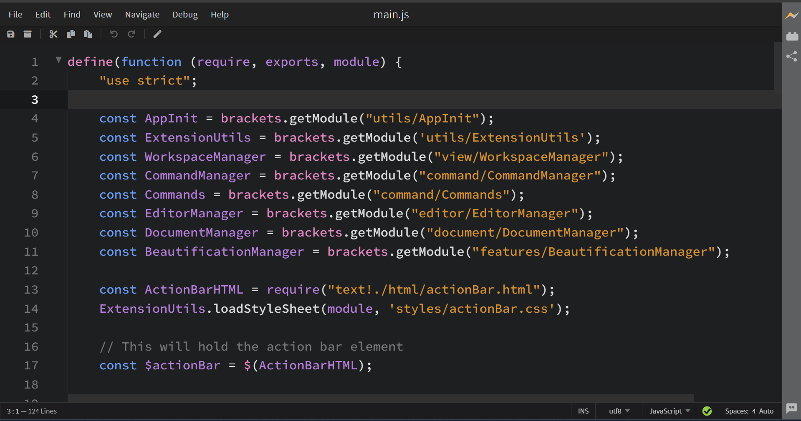
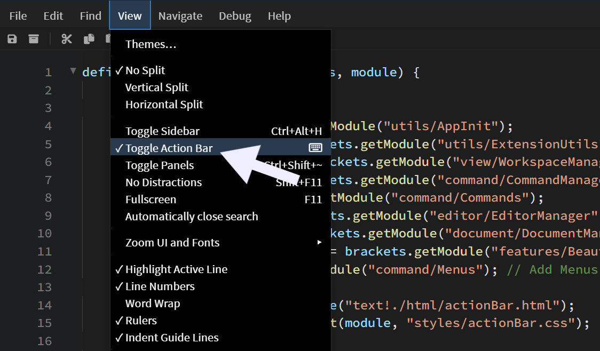

# Quick Actions

This extension creates a simple action bar below the title bar in Phoenix that provides easy access to commonly used buttons like Cut, copy, paste, save, save-all, undo, redo, beautify etc. This action bar was inspired from Notepad++ UI.

## What it does

This extension adds a toolbar below the title bar with buttons for:
- Save and Save All
- Cut, Copy, Paste
- Undo, Redo
- Beautify (code formatting)

## Installation

1. Open Phoenix Code
2. Go to Extension Manager
3. Search for "Quick Actions"
4. Click Install

## How to use

After installation, the action bar appears automatically. Just click any button to perform that action.

Buttons will be disabled when their actions aren't available (like Undo when there's nothing to undo).

You can also toggle the visibility of the action bar using View menu > Toggle Action Bar.

## License

MIT
